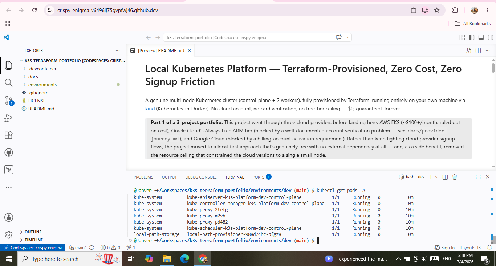
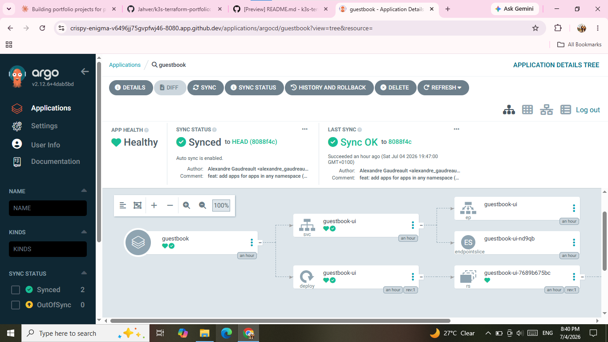
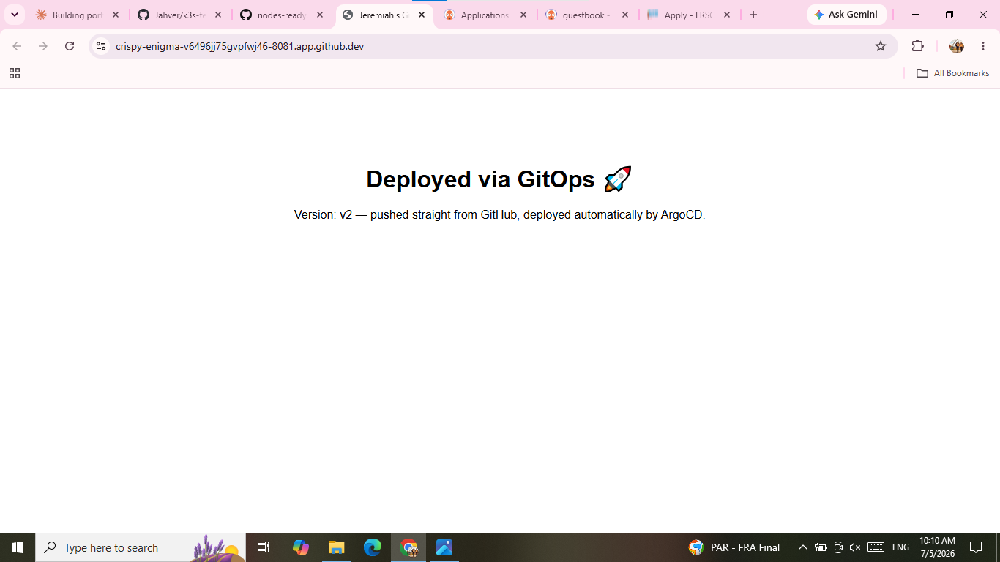

# Local Kubernetes Platform — Terraform-Provisioned, Zero Cost, Zero Signup Friction

A genuine multi-node Kubernetes cluster (control-plane + 2 workers), fully
provisioned by Terraform, running entirely on your own machine via
[kind](https://kind.sigs.k8s.io/) (Kubernetes-in-Docker). No cloud account,
no card verification, no free-tier ceiling — $0, guaranteed, forever.

> **Part 1 of a 3-project portfolio.** This project went through three cloud
> providers before landing here: AWS EKS (~$100+/month, ruled out on cost),
> Oracle Cloud's Always Free ARM tier (blocked by a well-documented account
> verification problem — see `docs/provider-journey.md`), and Google Cloud
> (blocked by a billing-account activation requirement). Rather than keep
> fighting cloud provider signup flows, the project moved to a local-first
> approach that's genuinely free with no external dependency at all — and,
> as a side benefit, removed the resource ceiling that constrained the
> cloud versions to a single small node.

## Why this is still a strong signal, not a downgrade

Real platform teams build and test infrastructure-as-code locally with
`kind` or `minikube` before it ever touches a cloud bill — this is a
standard, professional pattern, not a workaround. The Terraform code here
uses the same structure (providers, resources, outputs) you'd use against
AWS/GCP/Oracle; only the target changed. Section "Path to cloud" below
shows exactly what would change to redeploy this onto a real cloud account
once one is available.

## Architecture

```
                    Your machine (Docker)
                    ┌─────────────────────────────┐
                    │  kind cluster                 │
                    │                                │
                    │   control-plane (container)    │
                    │        │                        │
                    │        ▼                         │
                    │   worker-0 (container)           │
                    │   worker-1 (container)           │
                    └─────────────────────────────┘
```

## Why these choices

- **kind over minikube**: kind runs each node as a lightweight Docker
  container rather than a full VM, so a 3-node cluster is fast to create/
  destroy and cheap on resources — better suited to iterating quickly while
  building out Weeks 2-4 (ArgoCD, monitoring, ingress).
- **`tehcyx/kind` Terraform provider** instead of shell scripts: the cluster
  is a genuine Terraform resource (`kind_cluster`), with proper
  `terraform plan`/`apply`/`destroy` lifecycle, not a wrapper script that
  happens to call `kind create cluster`.
- **Multi-node from day one**: unlike the cloud free-tier versions
  (constrained to 1-2 small nodes), a local cluster has no such ceiling —
  you get the full control-plane/worker topology the original design called
  for.

## Option: run entirely in the browser (no local installs at all)

This repo includes a `.devcontainer/devcontainer.json`, which means you can
skip installing Docker, Terraform, kind, and kubectl on your own machine
entirely and instead use **GitHub Codespaces**:

1. Push this repo to GitHub
2. On the repo page: **Code** button → **Codespaces** tab → **Create
   codespace on main**
3. Wait ~1-2 minutes for the container to build (Docker-in-Docker,
   Terraform, kubectl, and kind all install automatically via
   `postCreateCommand`)
4. You now have a full Linux terminal, right in your browser tab, with
   everything needed already installed. Run the same commands from
   "Setup" below directly in that terminal.

**Free tier**: personal GitHub accounts get **120 core hours/month** —
about 60 hours of real time on the default 2-core machine, reset monthly.
More than enough to build, demo, and iterate on this project. No local
disk space, no RAM pressure on your own machine, nothing to install.

One thing worth knowing: Codespaces storage (15GB free/month) keeps
accruing on a *stopped* codespace, not just a running one — delete
codespaces you're done with rather than just stopping them, or the storage
quota can run down even while you're not actively using it.

## Prerequisites (if running locally instead of via Codespaces)

1. [Docker Desktop](https://www.docker.com/products/docker-desktop/) (or
   Docker Engine on Linux) — running before you `terraform apply`
2. [kind](https://kind.sigs.k8s.io/docs/user/quick-start/#installation) CLI
   installed (the Terraform provider shells out to it)
3. [Terraform](https://developer.hashicorp.com/terraform/downloads) >= 1.7
4. `kubectl`

No account signups, no cards, no verification steps for this part.

## Setup

```bash
cd environments/dev
terraform init
terraform plan
terraform apply
```

Then:

```bash
terraform output get_nodes_command   # copy/paste and run
```

You should see 3 nodes: 1 control-plane, 2 workers, all `Ready`.

## Tearing down / rebuilding

```bash
terraform destroy   # removes the containers entirely
terraform apply     # rebuilds from scratch in under a minute
```

Fast enough to do this repeatedly while iterating — a real advantage over
waiting on cloud provisioning.

## Repo structure

```
local-k3s-platform/
├── environments/
│   └── dev/
│       ├── versions.tf
│       ├── variables.tf
│       ├── cluster.tf       # the kind_cluster resource
│       ├── provider.tf      # kubernetes/helm wired to the cluster
│       └── outputs.tf
├── docs/
│   └── provider-journey.md  # honest write-up of the AWS→Oracle→GCP→local path
└── README.md
```

## Status / Roadmap

- [x] Multi-node Kubernetes cluster via Terraform, zero cost, zero signup
- [x] ArgoCD installed via Terraform/Helm
- [x] GitOps auto-sync proven end-to-end: a custom app, in this repo's
      `gitops-app/` folder, is watched by ArgoCD and deploys automatically
      on every `git push` — no manual `kubectl apply` involved
- [ ] Prometheus + Grafana — no resource ceiling here, so the full stack fits
- [ ] Ingress via NGINX (kind supports port-mapping straight to your
      machine's localhost, no cloud load balancer needed)
- [ ] `docs/path-to-cloud.md` — a short doc mapping each local resource to
      its cloud equivalent (kind node → EC2/Compute instance, local
      networking → VPC/VCN), demonstrating the design translates directly

## What's live right now

Three proof points, in order of how they build on each other:

1. **A real 3-node Kubernetes cluster**, entirely from `terraform apply`:
   

2. **ArgoCD running as the GitOps controller**, syncing an app from
   [Argo's own example repo](https://github.com/argoproj/argocd-example-apps)
   to prove the mechanism works:
   

3. **A custom app, in this repo's `gitops-app/` folder, deployed and
   updated purely via Git.** Editing the app's ConfigMap and pushing to
   `main` caused ArgoCD to detect the change and redeploy automatically —
   no cluster commands run by hand. This is the live result, rendering
   the exact text from the pushed commit:
   

*(Add your actual screenshots to `docs/screenshots/` and update the paths
above to match your filenames.)*

## Path to cloud (when you're ready)

The Terraform structure here is intentionally close to the cloud versions
already built for this project (see the AWS and GCP designs in the
portfolio history). Moving to a real cloud account later means swapping:

- `kind_cluster` → the cloud provider's compute/Kubernetes resources
- `provider.tf`'s kind-generated credentials → the cloud provider's IAM/
  service-account auth
- Local Docker networking → a real VPC/VCN

Everything else — the Helm releases for ArgoCD/monitoring, the Kubernetes
manifests, the GitOps workflow — carries over unchanged. That portability
is itself worth stating explicitly in interviews: the platform layer was
designed cloud-agnostically from the start.

## What I'd do differently at scale

- A local cluster obviously isn't reachable from the internet — fine for
  development and demos, not a substitute for real hosted infrastructure
- No real IAM/network isolation the way a cloud VPC provides — kind is a
  dev tool, not a production platform, and this project doesn't pretend
  otherwise
- Given a cloud budget, the next step would be exactly the AWS/GCP designs
  already built earlier in this project's history, redeployed with a
  verified account
